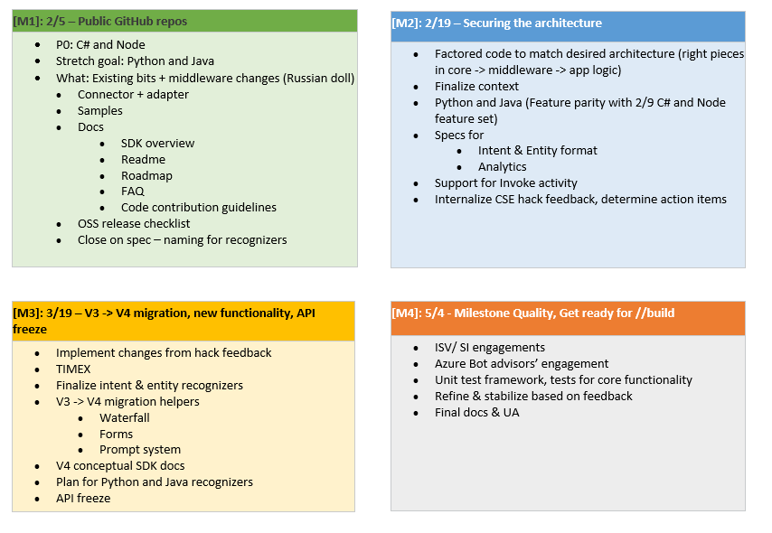

# Bot Builder SDK v4 Frequently Asked Questions
Bot Builder v4 SDK builds on the feedback and learnings from the prior Bot Builder SDKs. It introduces the right levels of abstraction while enabling rich componentization of the bot building blocks. You can start with a simple bot and grow your bot in sophistication using a modular and extensible framework.   

## Q: Who is this for? Why should I use this SDK?  
A: Bot Builder SDK v4 is for developers building bots using the Microsot Bot Framework.
The SDK strives to keep simple things simple and make complex things possible.
We are taking an open approach to building our v4 SDK together, with the community.
See the Contribution Guidelines below to participate in this project.

## Q: What can I build with this SDK?  
A:  You can get started by building a very simple bot and then scale it all the way up to support different types of interactions with users. You can design freeform conversations in your bot. Your bot can also have more guided interactions where it provides the user discrete choices or actions. The conversation can use simple text strings or more complex rich cards containing text, images, and action buttons. And you can add natural language interactions to allow your users to interact with your bots in a natural and expressive way. 
  
## Q: What happens to my bot built using Bot Builder SDK v3? 
A: Your current bot will continue to work as is. 
  
## Q: Where can I get help? Where do I report issues and feature requests? 
A: You can always get help by filing an issue on the appropriate GitHub issues page. Please remember to search issues to see if there already is a solution to what you are looking for. 
- .Net SDK issues – https://github.com/Microsoft/botbuilder-dotnet/issues 
- JS SDK issues – https://github.com/Microsoft/botbuilder-js/issues 
- Python SDK issues - https://github.com/Microsoft/botbuilder-python/issues 
- Java SDK issues - https://github.com/Microsoft/botbuilder-java/issues’ 
   
## Q: What are your code contribution guidelines?  
A: This project welcomes contributions and suggestions. Most contributions require you to agree to a Contributor License Agreement (CLA) declaring that you have the right to, and actually do, grant us the rights to use your contribution. For details, visit https://cla.microsoft.com. 
When you submit a pull request, a CLA-bot will automatically determine whether you need to provide a CLA and decorate the PR appropriately (e.g. label, comment). Simply follow the instructions provided by the bot. You will only need to do this once across all repos using our CLA. 
  
## Q: Is there a roadmap for this SDK? When will this be generally available?  
A: We typically look out 3 to 6 months to establish a set of investment areas we want to work towards. Below are the set of planned work through May 2018.

